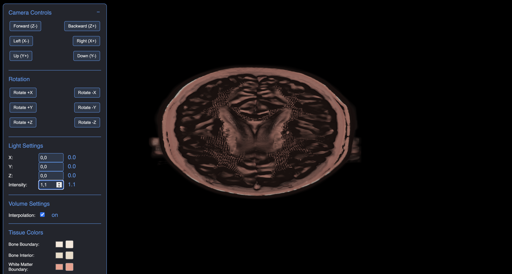

# Photorealistic Volume Rendering with WebGPU

A browser-based medical imaging visualization system that uses WebGPU for photorealistic volume rendering of medical scan data.

## Features

- **Interactive 3D visualization** of volumetric medical data
- **Real-time ray casting** with custom WGSL shaders for photorealistic rendering
- **Dynamic lighting model** with adjustable parameters for enhanced visualization
- **Interactive camera controls** for examining data from any angle
- **Customizable tissue classification** with adjustable transfer functions

## Requirements

- Modern browser with WebGPU support (Chrome/Edge 113+, Firefox with flags)
- Graphics hardware with compute shader capabilities

## Getting Started

1. Clone this repository
2. Start the local server: `python simple_server.py`
3. Navigate to `http://localhost:8080` in your browser

## Usage

- Use on-screen controls to adjust camera position and rotation
- Modify lighting parameters to highlight different features
- Experiment with transfer function settings to emphasize specific tissue types

## Project Structure

- `/assets/` - Brain MRI volume data
- `/js/` - Core application logic
- `/lib/` - Supporting libraries and data structures
- `/shaders/` - WGSL shader code for volume rendering
- `/ui/` - UI component templates